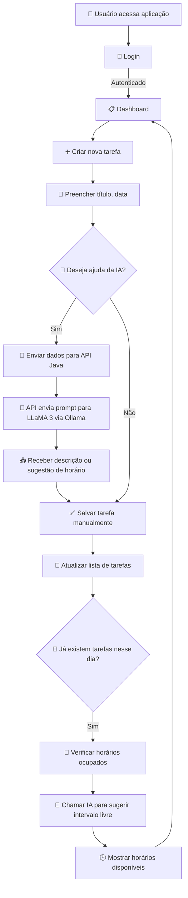

    # 🧠 To-Do com Integração de IA (LLaMA 3) – Projeto Fullstack

Este projeto é um sistema de gerenciamento de tarefas (To-Do) com autenticação, criação de tarefas e integração com IA utilizando o modelo **LLaMA 3 via Ollama**.

A IA é utilizada para:
- 📌 Gerar automaticamente descrições curtas das tarefas
- 🕐 Sugerir horários disponíveis com base nas tarefas existentes

---

## ⚙️ Tecnologias Utilizadas

| Camada       | Ferramenta                     |
|--------------|---------------------------------|
| Backend      | Java + Spring Boot+React        |
| IA           | LLaMA 3 via Ollama              |
| Frontend     | React (pode ser adaptado)       |
| Autenticação | JWT / OAuth2                    |
| Comunicação  | `HttpClient` com JSON           |

---

## 📊 Fluxo Geral do Sistema



---

## 🔌 Como Executar

### 🐘 Backend (Java + Spring Boot)
```bash
./mvnw spring-boot:run
```

### 🧠 LLaMA 3 com Ollama
```bash
ollama run llama3
```

> Garanta que sua API está acessando: `http://localhost:11434/api/generate`

### 💻 Frontend (exemplo com React)
```bash
npm install
npm run dev
```

---

## 📬 Exemplo de Prompt para IA

```text
Você é um assistente de agenda. Dado que os horários ocupados no dia 2024-05-20 são: 09:00, 11:00, 13:00,
responda apenas com os horários disponíveis desse dia (sem explicações, só os intervalos livres em formato HH:mm - HH:mm).
Retorne um array de strings.
```

---
    
